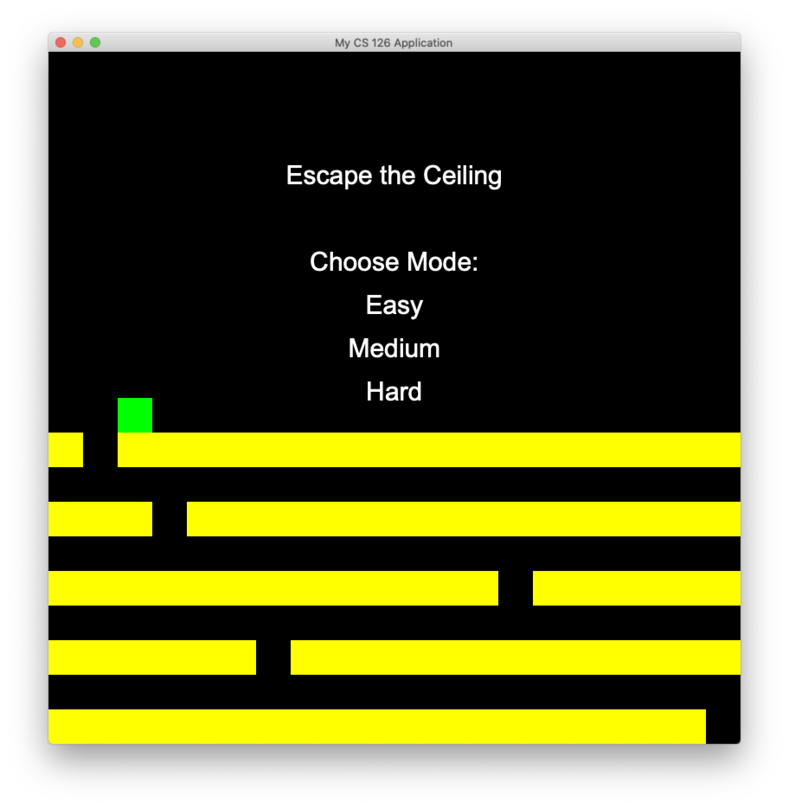
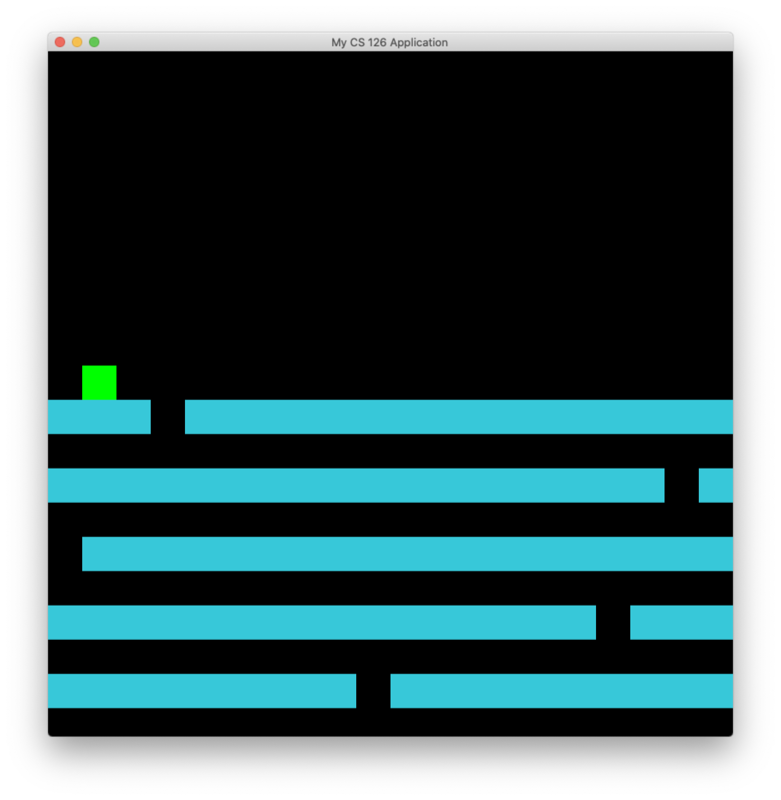
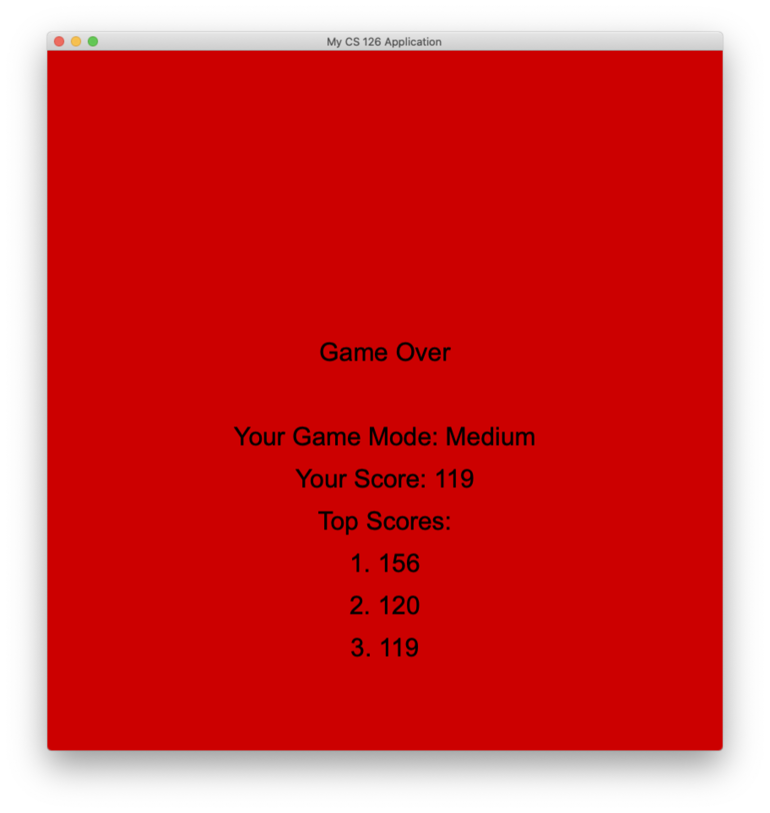

# Escape the Ceiling

Read [this document](https://cliutils.gitlab.io/modern-cmake/chapters/basics/structure.html) to understand the project
layout.

**Author**: Praval Telagi - [`ptelag2@illinois.edu`](mailto:ptelag2@illinois.edu)

## Dependencies

- [sqlite-modern-cpp] and sqlite3

    Sqlite-modern-cpp and sqlite3 were used in together to help keep track of the scores players achieve as they play the game. 
    Three databases are setup for each of the three difficulties to ensure that the scores from one difficulty are being compared 
    against the scores from the same difficulty. 

#### Keyboard
| Key       | Action                            |
|---------- |-----------------------------------|
| `d/RIGHT`       | Move to the right           |
| `a/LEFT`       | Move to the left             |
| `ESC`          | Quit Game                    |

[sqlite-modern-cpp]: https://github.com/SqliteModernCpp/sqlite_modern_cpp