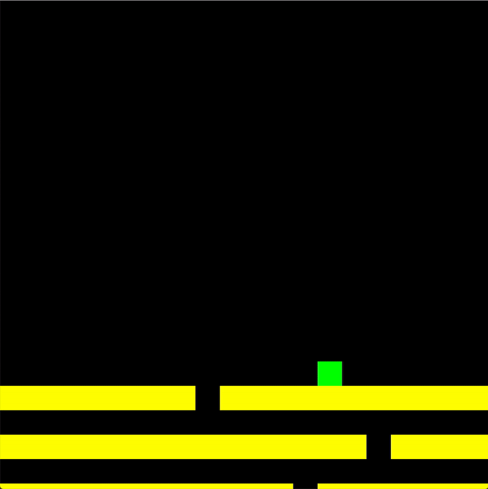

# Escape the Ceiling

Read [this document](https://cliutils.gitlab.io/modern-cmake/chapters/basics/structure.html) to understand the project
layout.

**Author**: Praval Telagi - [`ptelag2@illinois.edu`](mailto:ptelag2@illinois.edu)

## Dependencies

- [sqlite-modern-cpp] and sqlite3

    Sqlite-modern-cpp and sqlite3 were used together to help keep track of the scores players achieve as they play the game. 
    Three databases are setup for each of the three difficulties to ensure that the current player's score from one difficulty 
    is being compared against the scores from the same difficulty. 

## Gameplay

There are three difficulties to chose from at the beginning of the game: easy, 
medium, and hard.

Then use the keyboard controls (listed below) to control the block and make sure it keeps
falling through the holes in the floors. Every 5 seconds the speed increases making the difficulty
increase as the game progresses.

At the end of the game, the score the player achieved is displayed as well as their game mode.
Below that the top scores from the current game mode are displayed allow the player to see how 
their scores compared to others.

#### Keyboard
| Key       | Action                            |
|---------- |-----------------------------------|
| `d/RIGHT`       | Move to the right           |
| `a/LEFT`       | Move to the left             |
| `ESC`          | Quit Game                    |

[sqlite-modern-cpp]: https://github.com/SqliteModernCpp/sqlite_modern_cpp