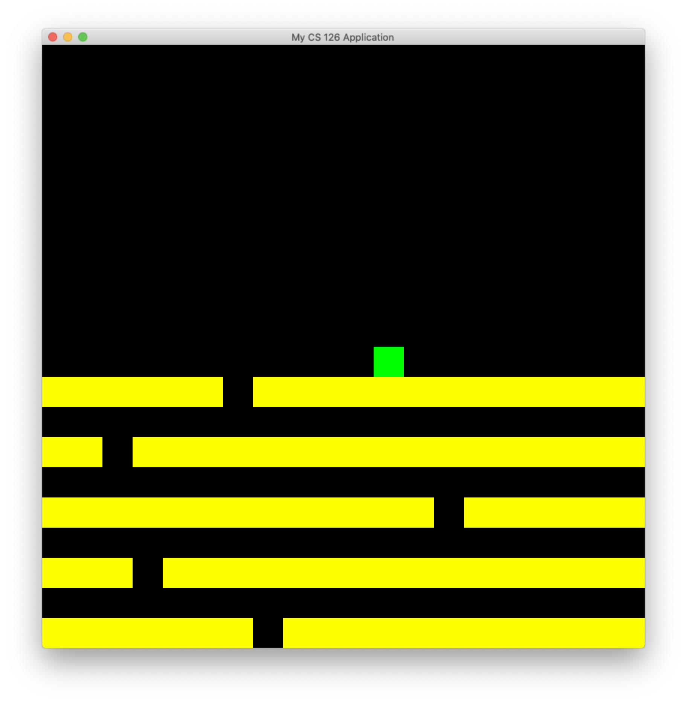

# Escape the Ceiling

Read [this document](https://cliutils.gitlab.io/modern-cmake/chapters/basics/structure.html) to understand the project
layout.

**Author**: Praval Telagi - [`ptelag2@illinois.edu`](mailto:ptelag2@illinois.edu)

#### Keyboard
| Key       | Action                            |
|---------- |-----------------------------------|
| `d/RIGHT`       | Move to the right           |
| `a/LEFT`       | Move to the left             |
| `ESC`          | Quit Game                    |

